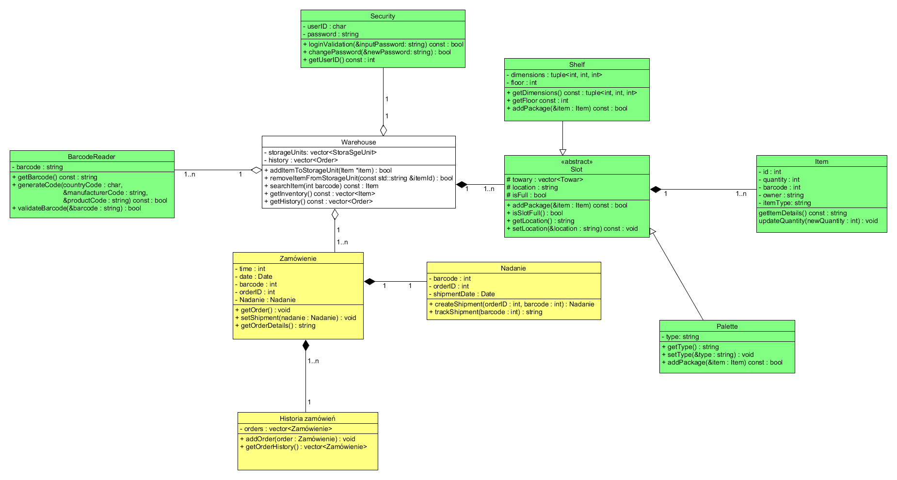

# 📦 PBL MAGAZYN

1. [Rozpoczęcie](#-rozpoczęcie)
   - [Wymagania](#wymagania)
   - [Kompilacja](#kompilacja)
2. [Dokumentacja](#-dokumentacja)
3. [Autorzy](#-autorzy)

## 🚀 Rozpoczęcie

### Wymagania

Aby zbudować i uruchomić ten projekt, będziesz potrzebować:

- Kompilator C++ (GCC, Clang, MSVC itp.)
- Make
- Git

### Kompilacja

1. **Sklonuj repozytorium:**

   ```sh
   git clone https://github.com/lukasz-strama/magazyn.git
   cd magazyn
   ```

2. **Skompiluj projekt:**

   ```sh
   make
   ```

   Jeśli nie masz zainstalowanego Make, możesz zainstalować go za pomocą Homebrew (dla systemów UNIX)

   ```sh
   brew install make
   ```

3. **Uruchom projekt:**

   ```sh
   ./Magazyn
   ```

4. **(Opcjonalnie) Wyczyść pliki budowania:**

   ```sh
   make clean
   ```

5. **Dla użytkowników VS Code:**

   Umożliwienie kompilacji poprzez skrót klawiszowy **Ctrl+Shift+B**
   
   .vscode/tasks.json
   ```json
   {
    "version": "2.0.0",
    "tasks": [
        {
            "label": "Make",
            "type": "shell",
            "command": "make",
            "group": {
                "kind": "build",
                "isDefault": true
            },
            "problemMatcher": []
        }
    ]
   }
   ```
   
## 📃 Dokumentacja

### Diagram UML klas:


## ✨ Autorzy

| Zarządzanie i prezentacja 👨🏻‍🏫 | Programowanie 🧑🏻‍💻 | Dokumentacja 📄 |
| ---------------------------- | ---------------- | --------------- |
| Michał Kucharski             | Daniel Śledź     | Wiktoria Pyka   |
|                              | Łukasz Strama    | Antoni Białecki |
|                              |                  | Antoni Grycmann |
